This is my personal ranking of the albums I listened to throughout 2024.

## 27 MGMT - Loss Of Life

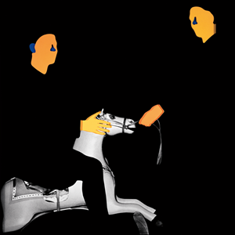

My biggest disappointment of the year.

## 26 Kim Gordon - The Collective

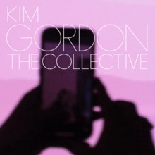

Tried to get into this one, but couldn’t.
Respect the trap metal experimentation.

## 25 Soccer Mommy - Evergreen

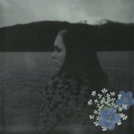

I like soccer mommy as an artist, but this album was a snooze fest.

## 24 Vampire Weekend - Only God Was Above Us

Listened to this for music club.
Not crazy about vampire weekend but this album was fine.

## 23 IDLES - Tangk

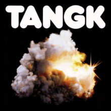

This was an okay release from IDLES.
I think the bangers bang, but they clearly want to write these slower ballads that do not hit for me.

## 22 St Vincent - All Born Screaming

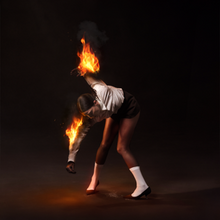

As an artist, I like her singles but I have never been crazy about her full albums.
I loved Broken Man.

## 21 Ginger Root - Shinbangumi

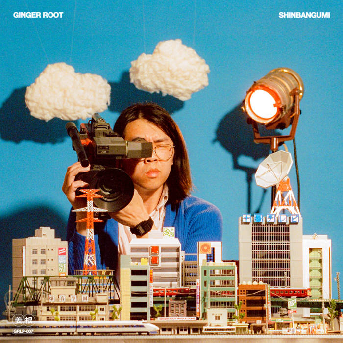

Took me a bit to get into this one.
It’s a solid full length debut and I’m excited to see where he goes.

## 20 NxWorries - Why Lawd?

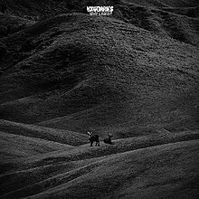

An extremely divorced album.
Solid beats, but don’t find myself coming back to it a ton.

## 19 Beabadoobee - This is How Tomorrow Moves

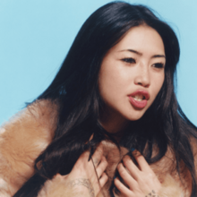

Listened to this a good bit when it came out, but I feel I’ve fallen off of it aside from the single.

## 18 Fontaines DC - Romance

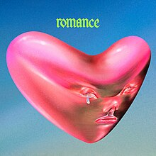

This album has some high highs and low lows.
Starburster and Here’s The Thing go so hard.
Some of the deep cuts are generic af.
I’m not sure this move to arena rock over post punk is the vibe for them but they can make the sound work.
I'm glad to see they've gotten quite a bit of positive reception on this album.

## 17 Charli XCX - Brat

It was impossible to avoid Brat in 2024.
This is the first Charli album I actually got into.
It’s another one with high highs: 365, Sympathy is.
Knife, Von Dutch, & Mean Girls.
I find the album is inconsistent for me & I don’t return to it often.

## 16 DIIV - Frog in Boiling Water

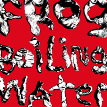

DIIV are another artist I love their singles but haven’t listened to their full records a ton.
This album has some great highlights: Frog in boiling water & somber the drums come to mind.
I do find the album is a bit repetitive in the middle.

## 15 Julie - My Anti Aircraft Friend

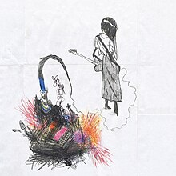

This is a late addition for me.
I discovered this band in December, so this placement may be influence by recency bias.
Like other albums at this point in my list I find it has great highs but is a bit inconsistent and at time samey.
I particularly love: Catalog, ‘thread, stitch’, piano instrumental, stuck in a car with angels.
Excited to see where this band goes after their strong debut.

## 14 The Last Dinner Party - Prelude to Ecstasy

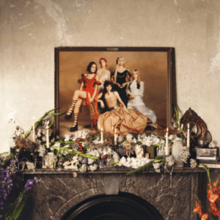

Another full length debut!
This band gives me Kate Bush x Bat For Lashes x Florence and the Machine vibes.
They have such a defined sound for a first album.
I prefer the bangers and singles to the slower tracks.
I find the end of the album to be a bit weak.

I loved: Burn Alive, Caesar on a TV Screen, The Feminine Urge, Sinner

## 13 Denzel Curry - King of the Mischievous South II

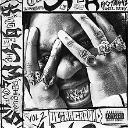

Denzel remains a consistently good rapper.
This isn’t my favorite album by him, but when I’m in the mood for this album it hits.

## 12 The Smile - Cutouts

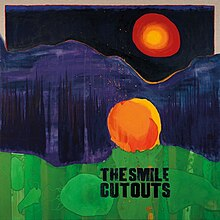

The second of the two albums from the Smile.
This one’s very inconsistent.

Great songs: Zero sum, eyes and mouth, colors fly, & bodies laughing.
Duds: Foreign spies, instant psalm, & tiptoe

## 11 Yard Act - Where’s my Utopia?

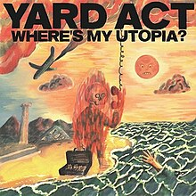

Just barely missing the top 10 is Yard Act.
I listened to this dancey post-punk album a good bit in June, but kind of fell of it until revisiting it to make this list.
This album has quite a few bangers.
I like the way they use samples and a radio theme throughout the album.
Reminds me a bit of *Songs for the Deaf* in that way.

## 10 JPEGMAFIA - I Lay Down My Life for You

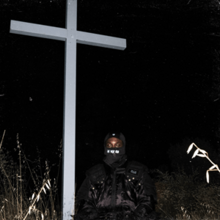

JPEG is another consistently great artist.
I didn’t enjoy this album as much as *LP!* or *Scaring the Hoes* but I like the punk rock direction he moved his production into.
Some of the slower cuts on this album aren’t as strong to me as songs like Free the Frail or Sick Nervous & Broke.

## 9 Clairo - Charm

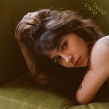

I enjoyed this album a lot.
I think it’s a huge improvement over her last album *Sling*.
I love the 60s/70s sound to the whole album.
I wish it had a bit more variety like immunity, but I think this is her most consistent album in terms of quality yet.
Sexy to Someone was my most streamed song of the year according to Apple Music.

## 8 Chat Pile - Cool World

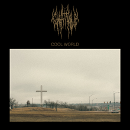

This is another album that may be high up due to recency bias, as I got really into it around October / November.
I liked this album more than their debut.
The only song that’s a skip to me is *Recorder*.
I love the crushing sludge atmosphere Chat Pile create.

Favorite tracks are: Masc, Shame, Tape, Frownland.

## 7 The Smile - Wall of Eyes

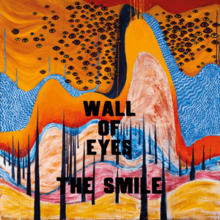

While this album may have been the slower of the two Smile albums from the year, I think it’s the much stronger album.
When this came out I replayed it a ton.
While I only revisit it on occasion today, I think this album belongs next to the better Radiohead and Thome solo records.
Favorites for me are: Teleharmonic, Read the Room, & Under Our Pillows.
I’m mixed on Bending Hectic, when I’m in the mood for it, it goes hard.

I love the album art for both albums, but I prefer this one's cover.

---

This is where the list starts getting very competitive.

## 6 Kit Sebastian - New Internationale

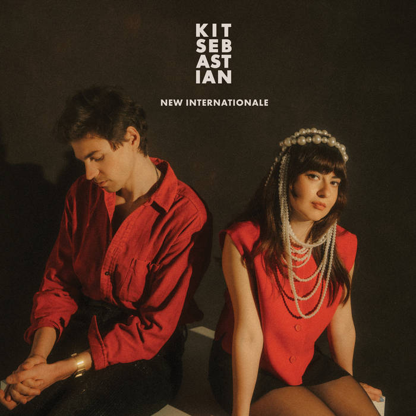

I found this album entirely by circumstance.
I was at a record store one day and the guy working put it on.
I liked what I heard so much I stayed to listen to the whole thing and bought it on the spot.
I really like their blend of psychedelic pop, lounge music, rock, jazz, & non-western instrumentation.
I don’t think there’s a bad song on this album, it’s extremely consistent.

## 5 Tyler, the Creator - Chromakopia

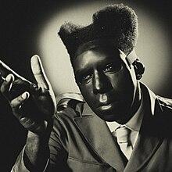

I agree with the audience sentiment that this is somewhat Tyler’s own Mr Morale.
My biggest let down of this album is I don’t feel Tyler reinvented his sound the same way he has with his last three albums.
That being said, I still love this album.
I love how vulnerable and personal this album is after the victory lap of “Call Me If you Get Lost”.

Favorites for me are: St. Chroma, Rah Tah Tah, Noid, I Killed You, Take Your Mask Off, Thought I Was Dead, Baloon.
The “(or this women)” line is easily one of the funniest of the year.
One of my favorite album covers of his.

## 4 Geordie Greep - The New Sound

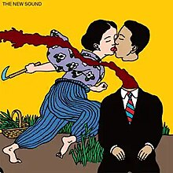

Apple Music says this was my second most streamed album of the year.
I have so many thoughts on it.

On the one hand, I think it’s the best thing Geordie has done since black midi’s *Schlagenheim*.
On the other, I find the album to have some major duds, such as the final song which is a cover of *If You Are But a Dream*.

That being said, I also think this album has some of Geordie’s most exciting songwriting yet: Blues, ‘Holy, Holy’, Walk Up, & Motorbike.
I do feel the absence of the other black midi members.
I find the bass parts on this album aren’t as memorable as a lot of black midi’s music.
Also, some of the best tracks are the ones where Morgan plays the drums (looking at you Blues).
Despite my thoughts, I listened to this album a lot and am excited to see what Geordie does next.

## 3 Kendrick Lamar - GNX

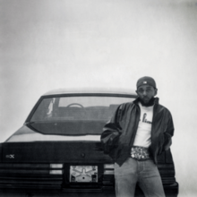

This album was a complete surprise by Kendrick the weekend before Thanksgiving.
Had it come out earlier in the year, it may have been higher on my list, but I fear I already may be placing it so high due to recency bias & the banger of a year Kendrick had.
We started the summer with essentially an EP of Kendrick dunking on Drake.
Then we got this album where Kendrick point blank says “Fuck a double entendre, I want y'all to feel this shit” & I feel he delivered.

This album doesn’t feel as conceptually as his other LPs, however I think this album benefits from the focus.
Kendrick puts out some of his strongest bangers since Humble & even Good Kid Maad City.
I like this album more with each listen.

Favorites are: Wacced Out Murals, Squabble Up, Reincarnated, Hey Now!, TV OFF, Peekaboo (also has my favorite feature), & Gloria.
The only song I’m mid on is Luther.

## 2 Crumb - AMAMA

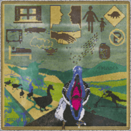

This is the year I got into crumb after listening to their singles for a couple years.
This album took me the longest to get into of their three, but I think it is the strongest of their discography.
I feel this record has no skips & plenty of bangers.

I feel crumb are beginning to perfect their psychedelic pop sound.
The bass tones  & lines are as strong as ever.
Bass standouts are Genie, (Alone in) Brussels, The Bug & Sleep Talk.
I love the tremolo guitar solo on Crushxd.

I found this album is highly repayable and its layers leave you finding more with each listen.
My number two slot was probably my most competitive, had Kendrick dropped sooner, maybe he would have dethroned crumb, but I continue to return to the album.

## 1 Magdalena Bay - Imaginal Disk

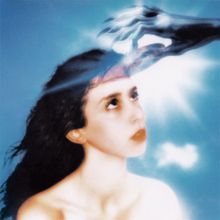

No disrespect to the other albums on this list, but the competition for my number one slot was not even close.
After hearing buzz about this album online, a friend told me to check out this album after seeing crumb.

On my first listen, I thought it was decent but only Killing Time & Tunnel Vision grabbed me.
By my third listen, I was hooked.
It’s been a minute since I was this obsessed with and excited by an album.
Magdalena Bay get compared to Grimes a lot, and have cited her as an influence.
Their music feels to me what I want out of Grimes & Kero Kero Bonito combined.
They obviously have other influences as well, however those are the first two artists that come to my mind when I listen to this album.

I absolutely love the cover art and packaging for this album.
That includes their creative music videos for Image, Death & Romance, & That’s My Floor.
The bass playing across many songs on this album is so cool to me.
Some bass standouts are: Killing Time, Image, Death & Romance, That’s My Floor, Cry For Me, & Love is Everywhere.

The production on this record is immaculate.
I love all the little character pieces sprinkled into each song’s mix.
Some examples are the pac man noises in Killing Time or the thudding crash in Image.
Another example is the evil laugh that can be heard throughout the album.
I appreciate how this album blends pop songwriting with expectation subversion.
Examples of this are ‘Fear, Sex’, Watching TV, Tunnel Vision, & Cry For Me.
Additionally, Matt & Mica can write a banger climax.
Look at Killing Time, Image, Watching TV, Tunnel Vision, & That’s My Floor.
